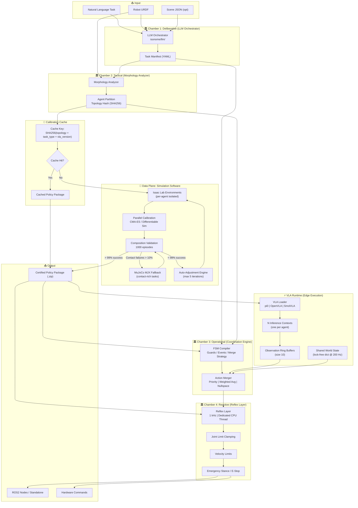
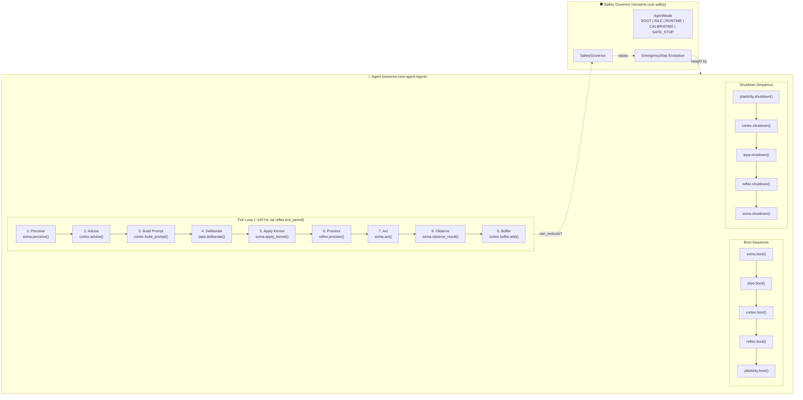
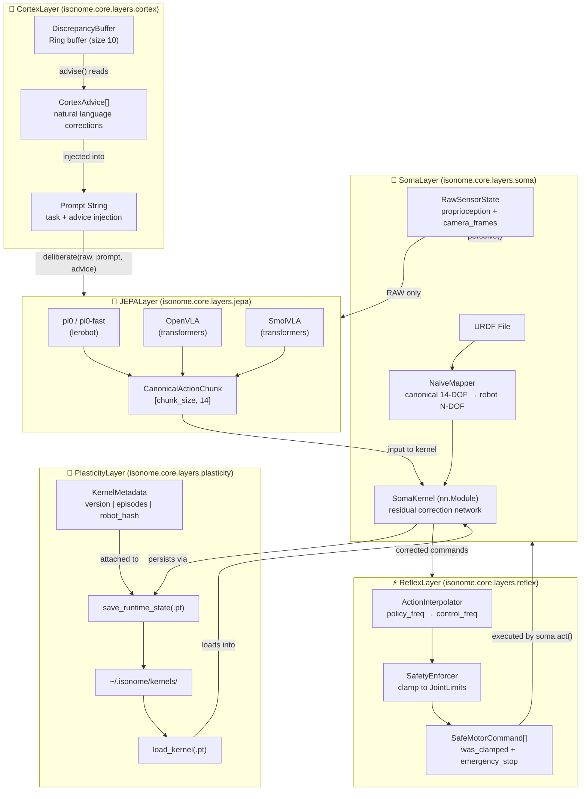
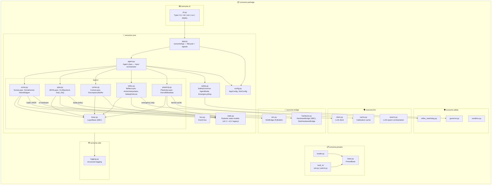
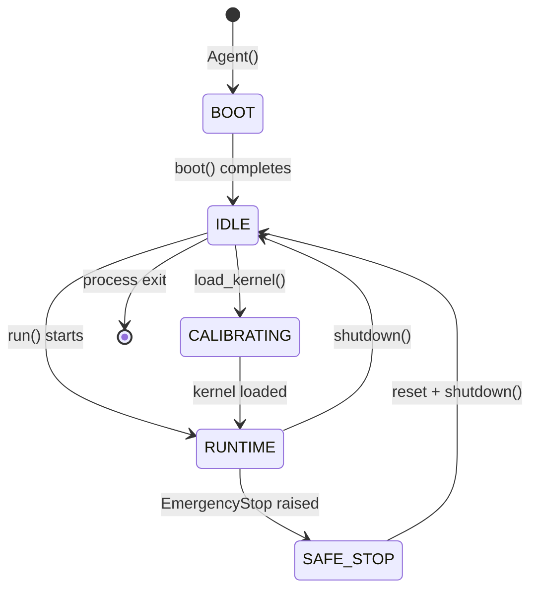
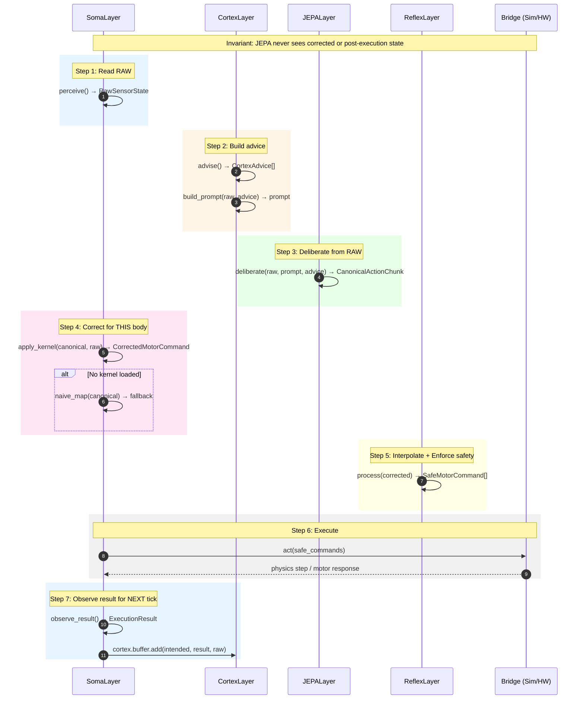
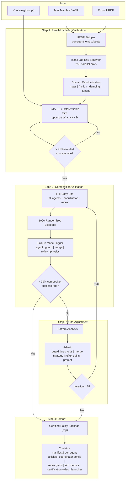
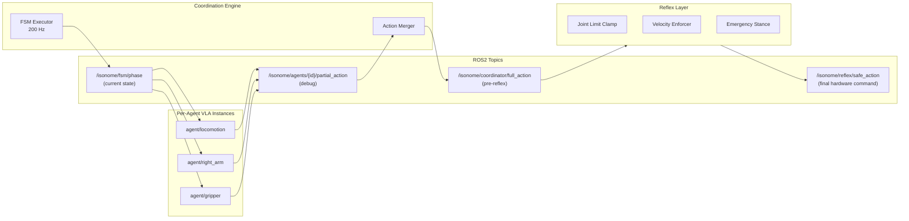
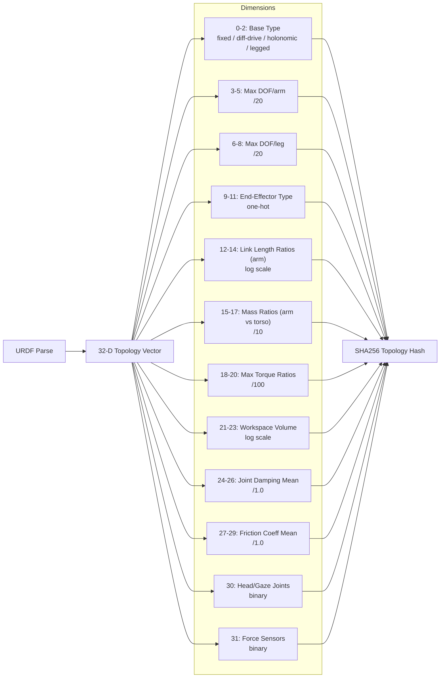

# Isonome Full Architecture

#> Generated from PRD.md + codebase analysis.  
#> PRD version: 0.1 | Code version: 0.2

---

## Diagram 1: High-Level System (PRD View)

---

## Diagram 2: Agent Layer Pipeline (Code View)

---

## Diagram 3: Layer Detail — Data Transformations

---

## Diagram 4: Module Dependency Map

---

## Diagram 5: State Machine — Agent Modes

---

## Diagram 6: Tick Invariant (One-Frame Delay)

---

## Diagram 7: Simulation / Calibration Pipeline (PRD Future State)

---

## Diagram 8: Runtime ROS2 Topic Topology

---

## Diagram 9: Topology Vector (32-Dimensional)

